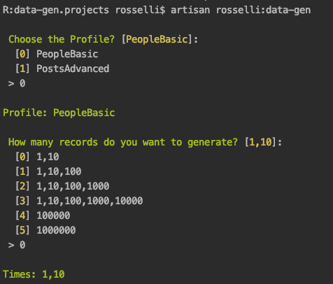
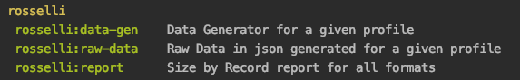
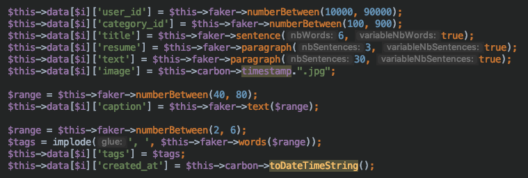
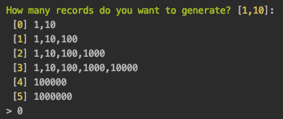
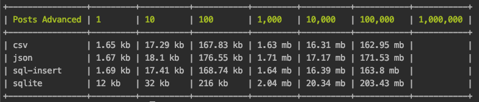

# Data-Gen
Data Generator application based on Profiles.<br> 
You just have to create a profile and generate your data in four formats _(CSV, JSON, SQL's insert, SQLite)_.

I described in the article [What's the size of the data?](https://medium.com/@rosselli00/whats-the-size-of-the-data-e67ddcd3f713) my motivation to develop this project.

> A hidden advantage of the Data-Gen is to estimate the size of a given data structure will have in a database and/or in a request's payload.

## Usage
After ```git clone``` type on console ```php artisan rosselli:data-gen```.



Available commands.



## Profiles
A profile is the data structure (schema) that will be generated.
For example, the Post schema is _**user_id, category_id, title, resume, text, image, caption, tags, created_at**_.

1. Create a class in ```App\Http\Controllers\Profiles```.
1. Extend Profile ```class Posts extends Profiles```.
1. Call Profile's constructor ```parent::__construct($records)```
1. Implement the Profile's abstract methods ```setTableName(), setFolderName(), generateData()```
1. With [Faker](https://github.com/fzaninotto/Faker) library, implement the schema.

 

## Records
Data-Gen has six predefined sets of records to generate.

 

If you want to customize the sets, edit ```app/Console/Commands/DataGen.php```

## Formats
Data-Gen generates data in CSV, JSON, SQL's Insert, and Sqlite. 

## Storage
The data is generated in ```storage/app/data-gen/[profile]```. 

## Report
After generating the data, type on console ```php artisan rosselli:report```.

 
